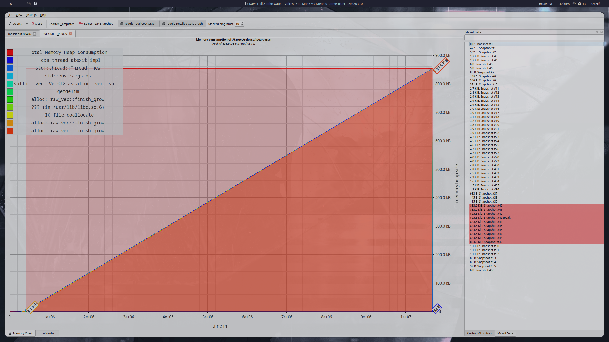
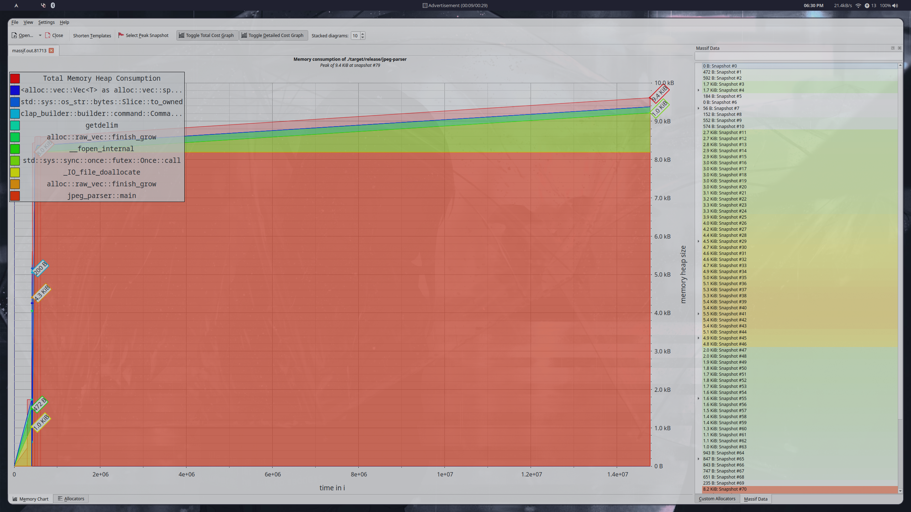

# JPEG Parser

As part of a look into how JPEG files store their data, and how
to encode data within them, I am attempting to build a simple parser
for them.
So far, the program reads simple data such as the resolution and bit depth,
whilst having a focus on being performant and efficient.
Commit ed4e7eb introduces changes which reduce the memory consumption of
a 900kb image from 920kb to 9.4kb, as well as reducing the total running time
from just over a millisecond to around 400 microseconds.

I found a bunch of useful information regarding the offsets and different types
of markers [here](https://www.ccoderun.ca/programming/2017-01-31_jpeg/)
For benchmarking, I used hyperfine, along with valgrind for monitoring the memory usage.

